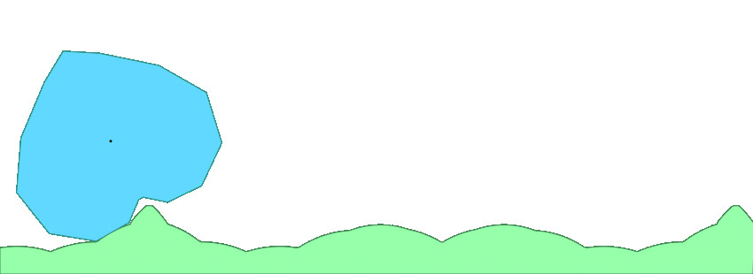

# ONWARD

## nON-circular-Wheel-Adapted-RoaD

ONWARD (nON-circular Wheel Adapted RoaD) allows anyone to design a shape for a wheel, and will calculate the road adapted for it.

Website link: https://pauldubois98.github.io/nON-circular-Wheel-Adapted-RoaD/

Example:

